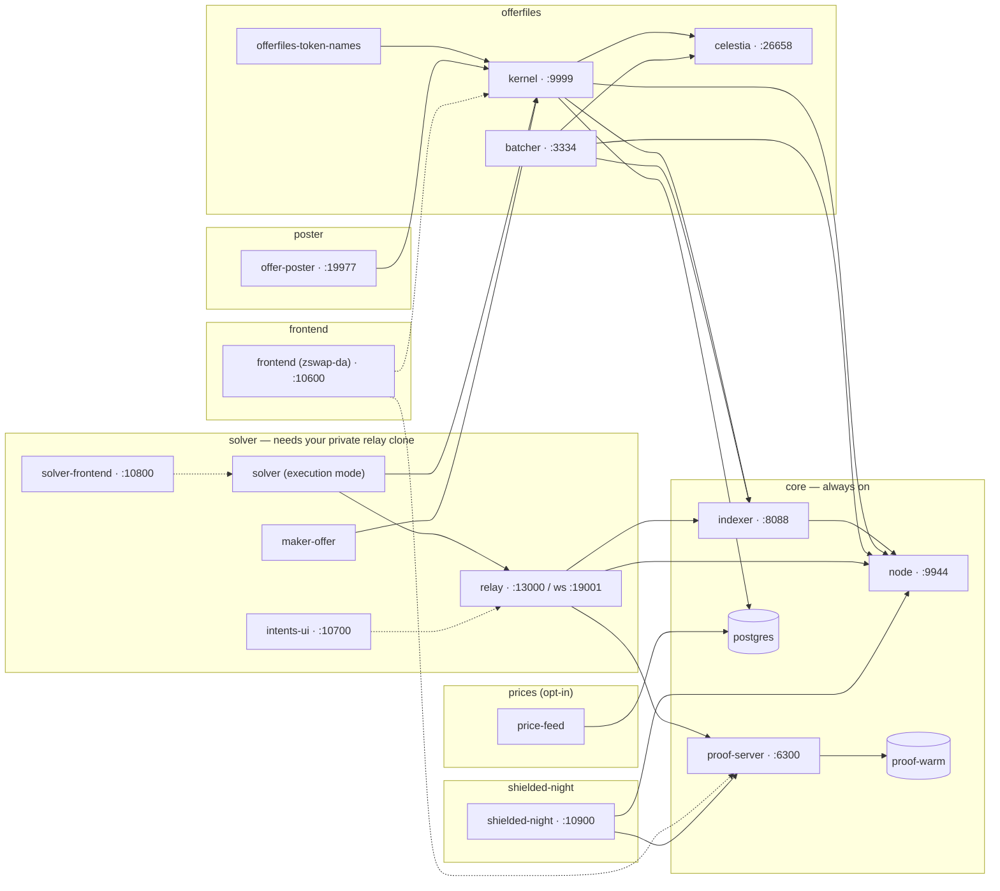

# midnight-1-offers

A one-command **Midnight 1.x** demo stack: a local devnet (midnight-node 1.0.0, indexer
4.3.3, proof server 8.1.0), a Celestia DA devnet, the **offer-files kernel** and its batcher,
the **zswap-da** trading SPA, the **Shielded NIGHT** dApp (NIGHT ⇄ sNight), and the
**Midnight Intents relay + COW solver** settling real intents against the offer book.

It is the 1.x sibling of [`midnight-2-offers`](https://github.com/acedward/midnight-2-offers)
and follows the same operating model — compose profile fragments, `./up.sh --with <profile>`,
`./down.sh -v`, `./verify.sh`, every external artifact pinned by digest or full commit SHA,
every published port loopback-bound and parameterizable.

Two deltas beyond the version line:

- **dropped**: the AA profile (aa-contracts, AA console, experimental proof server) and the
  EVM profile — neither exists here.
- **added**: the real Midnight Intents relay and its browser UI, with the COW solver in
  **execution mode** settling relay intents against the kernel book. `midnight-2-offers`
  deliberately stopped at an observation-only sink; this repository runs the whole lane.
- **added**: the `poster` profile — the kernel's own **offer poster**, a funded, dedicated
  wallet that mints one faucet coin a minute and posts one sponsored, individually takeable
  ZSwap offer spending exactly that coin. The book supplies itself, so the SPA has something
  real to trade against without a human.
- **added**: the `prices` profile — the kernel's own **price feed**, one CoinGecko
  `simple/price` call a day into `asset_prices`, so the USD reference behind `GET /v1/prices`,
  `GET /v1/quote` and the sponsorship gate is live rather than the schema's 2026-09-02 seeds.
  It needs a free CoinGecko demo key in `.env` — the only secret in this stack — and without
  one it comes up and idles, because the seeded prices already quote real ratios.
- **added**: the `shielded-night` profile — [`effectstream/shielded-night`](https://github.com/effectstream/shielded-night),
  a Compact contract plus a page that wraps native unshielded NIGHT into a shielded token
  (**sNight**) 1:1 and back. It depends only on `core`, deploys its contract once per stack,
  and is verified by upstream's own integration round trips run against this stack. Bring it up
  **with `offerfiles`** and native NIGHT becomes tradable on the offer-files book: `./verify.sh`
  wraps it, posts a real MIP-0005 offer file carrying sNight, has a second wallet settle that
  offer, and has that wallet unwrap what it bought — with exact balances at every step.

> **STATUS — shipped.** All seven profiles run real services: `./up.sh --all` brings up the
> whole stack from a clean host and `./verify.sh` gates it end to end. The stack tracks the
> offer-files kernel's own `main` — currently `a608fa6`, **the whole-coin line** (every token is
> 6 decimals and one faucet press mints 1 000 whole coins = 1 000 000 000 base units), with the
> `zswap-da` SPA on its matching `midnight-1` head `58ab921`. **Re-pinning an EXISTING stack
> forward onto this line is BREAKING for its `postgres` volume — `./down.sh -v` first; see
> [`docs/OPERATIONS.md`](docs/OPERATIONS.md).**

## Profiles

A profile **is** a compose fragment in `compose/`, named after the file. There are exactly
seven, and `compose:` `profiles:` keys are never used anywhere in this repository — `up.sh`
never passes `--profile`, so a service carrying one would silently never start.

Every box below is one compose service with its default host port; solid arrows are
`depends_on`, dotted arrows are runtime reads that carry no start-order guarantee.



One row per profile, in the order `--all` starts them. Service names are the compose names
you use with `docker compose … logs <service>`. Ports are the `.env.example` defaults.

| Profile | Services | Default endpoints |
|---|---|---|
| [`core`](compose/core.yml) — always | `node` · `indexer` · `proof-server` · `proof-warm` · `postgres` | node RPC `http://127.0.0.1:9944` · indexer `http://127.0.0.1:8088` · proof `http://127.0.0.1:6300` · postgres internal |
| [`offerfiles`](compose/offerfiles.yml) | `celestia` · `offerfiles-deploy` · `kernel` · `batcher` · `offerfiles-token-names` | kernel API `http://127.0.0.1:9999` · batcher `http://127.0.0.1:3334` · Celestia DA RPC `http://127.0.0.1:26658` |
| [`frontend`](compose/frontend.yml) | `frontend` | zswap-da SPA `http://127.0.0.1:10600` |
| [`shielded-night`](compose/shielded-night.yml) — needs only `core` | `shielded-night-deploy` · `shielded-night` · `shielded-night-token-name` · `shielded-night-verify` | sNight dApp `http://127.0.0.1:10900` |
| [`solver`](compose/solver.yml) — needs `RELAY_SOURCE_DIR` | `relay` · `solver-provision` · `maker-offer` · `solver` · `solver-frontend` · `intents-ui` | relay `http://127.0.0.1:13000` · relay WS `:19001` · monitor **`http://127.0.0.1:10800`** · intents UI `http://127.0.0.1:10700` · status listener `solver:9100` internal only |
| [`poster`](compose/poster.yml) | `poster-provision` · `offer-poster` | health `http://127.0.0.1:19977/health` (+ `/metrics`, `/journal`) |
| [`prices`](compose/prices.yml) — opt-in, needs `COINGECKO_API_KEY` | `price-feed` | no port; writes `asset_prices`, read back via kernel `/v1/prices` |

What each profile actually does, service by service — the whole-coin line, the sponsorship
gate, the exact-coin guarantee, the price feed's key rules, the sNight round trip — is in
[`docs/COMPONENTS.md`](docs/COMPONENTS.md).

```sh
./up.sh                                    # core alone
./up.sh --with offerfiles                  # …and Celestia + kernel + batcher
./up.sh --with offerfiles --with frontend  # …and the SPA
./up.sh --with shielded-night              # the Shielded NIGHT dApp (core is all it needs)
./up.sh --with offerfiles --with shielded-night   # …and sNight is tradable on the offer book
./up.sh --with offerfiles --with prices    # …and live CoinGecko reference prices (needs a key)
./up.sh --all                              # every profile
./verify.sh                                # assert the stack is usable, not merely running
./down.sh -v                               # stop and wipe every volume of this project
```

`--with` is additive: it never stops a profile that is already up. `--converge` is the
opposite and names everything it is about to stop before it does it.

## The `solver` profile builds from a PRIVATE clone you provide

The relay and the intents UI come from **`shieldedtech/midnight-intents-swaps`**, which is a
**private** repository. This one is public, so their source is never fetched, vendored or
mirrored here. Instead:

- you clone the private repository yourself and point `RELAY_SOURCE_DIR` at the **workspace
  directory inside** that clone — the build context, not the clone's root:

  ```sh
  git clone git@github.com:shieldedtech/midnight-intents-swaps.git ./local/intents-swaps
  git -C ./local/intents-swaps checkout 061f4d3258e25b9f3a451b4b4358ed232349d96b
  echo 'RELAY_SOURCE_DIR=./local/intents-swaps/phase1-native-swaps' >> .env
  ```

  (The subdirectory is spelled out here and in `.env.example` rather than appended for you by
  a script: the leak scan below treats that directory's name as source content anywhere
  outside prose or a comment, so nothing in this repository is allowed to compose the path.)
- `up.sh` verifies your clone is at the pinned commit and has a clean tree **before** any
  build starts, and fails with a clear message when the variable is unset;
- the build reads it as a named build context; the `Dockerfile`s committed here are our own
  transcriptions and contain no copied code;
- the resulting `midnight-1-offers/relay:local` and `…/intents-ui:local` images are **never**
  pushed to any registry.

Everything else — `core`, `offerfiles`, `frontend` — builds from public sources with no
credentials at all, so the repository degrades gracefully: without private access you get the
whole stack except the intents lane.

Two mechanisms keep this honest, and they run from day one:

- `.gitignore` ignores `local/`, the conventional place to put your clone inside the checkout,
  so it cannot be staged by accident;
- `./scripts/verify-no-private-source.sh` (wired into `scripts/ci-check.sh`) scans every
  tracked file and fails on private-source markers. It distinguishes *naming* the upstream —
  fine in Markdown, in `#` comments, and in the pinned identity in
  `config/artifact-decisions.json` — from *carrying* its content, which is never fine.
  Run it with `--self-test` to see every rule reject a synthetic leak.

## Everything external is pinned

No tags, no branch names, no "latest". Official images are pinned by **index digest**, source
builds by **full 40-hex commit SHA**, downloaded binaries by **SHA-256**. The single record is
[`config/artifact-decisions.json`](config/artifact-decisions.json), and four offline gates
keep it and the repository in agreement:

| Gate | Asserts |
|---|---|
| `./scripts/render-readme-pins.py --check` | the README's pin table below still says what the compose defaults, the Dockerfile `ARG`s, `.env.example` and the matrix say — and that no source pin has two different defaults in the tree |
| `./scripts/verify-artifact-decisions.sh --self-test` | the matrix is internally consistent, still makes the choices it froze, and its `pinsDigest` still covers every identity field |
| `./scripts/verify-compose-pins.sh --self-test` | the **rendered** compose configuration really asks for those bytes — no tag-only image, no forced `platform:`, no `profiles:` key, no drifted build arg |
| `./scripts/verify-source-pins.sh` | the images that are actually **running** were built from the configured commits (needs a live stack) |

All four are offline: no daemon, no network, no registry, no credential.

### Where every component comes from

The **Pin** column links to the exact commit; the **Pinned in** column is every file that
carries that default, so you know what to edit. **This table is generated** —
`scripts/render-readme-pins.py --write` renders it from the sources above, the prose per row
lives in [`config/readme-components.json`](config/readme-components.json), and `ci-check.sh`
fails when the block is stale.

<!-- render-readme-pins:begin — GENERATED by scripts/render-readme-pins.py --write from compose/, images/, .env.example and config/artifact-decisions.json. Edit config/readme-components.json, not this block. -->
| Component | Source | Pin | Pinned in |
|---|---|---|---|
| Midnight node `1.0.0` | [`midnightntwrk/midnight-node`](https://hub.docker.com/r/midnightntwrk/midnight-node) *(upstream image)*, `CFG_PRESET=dev` | index digest `ede01da35e98…` | `config/artifact-decisions.json` · `.env.example` |
| Indexer `4.3.3` | [`midnightntwrk/indexer-standalone`](https://hub.docker.com/r/midnightntwrk/indexer-standalone) *(upstream image)* | index digest `03afd079b00b…` | `config/artifact-decisions.json` · `.env.example` |
| Proof server `8.1.0` (+ `proof-warm` pre-warm) | [`midnightntwrk/proof-server`](https://hub.docker.com/r/midnightntwrk/proof-server) *(upstream image)* | index digest `801bbc0340e9…` | `config/artifact-decisions.json` · `.env.example` |
| Celestia app `6.4.10` / node `0.28.4` | [`effectstream/binaries@0.3.120`](https://github.com/effectstream/binaries/releases/tag/0.3.120), each archive byte-equal to the official celestiaorg release | SHA-256 per arch | `config/artifact-decisions.json` · `.env.example` · `compose/offerfiles.yml` · `images/celestia/Dockerfile` · `scripts/lib/common.sh` |
| PostgreSQL + `pg_ivm 1.11` | `postgres` *(upstream image)* with `pg_ivm` compiled in | `PG_IVM_VERSION=1.11` | `.env.example` · `compose/core.yml` · `images/postgres/Dockerfile` |
| **Offer-files kernel · batcher · COW solver · maker-offer · offer poster · price feed** (ONE image) | [`effectstream/zswap-offerfiles-kernel`](https://github.com/effectstream/zswap-offerfiles-kernel) `main`, the whole-coin line (6 decimals everywhere); compactc 0.30.0. The solver has no second pin and no `.solver-commit`. Since kernel [#68](https://github.com/effectstream/zswap-offerfiles-kernel/pull/68) the upstream mint also tries to register its own `TESTTOKEN*` names — it cannot reach a kernel from this stack's deploy one-shot, and `offerfiles-token-names` fails loudly rather than accept a foreign name for one of our colours. A `postgres` volume older than `c293ebd` needs `./down.sh -v` before this pin; `c293ebd` → this pin does not | [`a608fa67419c`](https://github.com/effectstream/zswap-offerfiles-kernel/commit/a608fa67419c16188e9405417ecdf34f3f7c47a1) | `.env.example` · `compose/offerfiles.yml` · `compose/solver.yml` · `images/offerfiles-kernel/Dockerfile` · `scripts/lib/common.sh` |
| zswap-da SPA | [`effectstream/effectstream` `templates/zswap-da`](https://github.com/effectstream/effectstream/tree/58ab921be5513b77937a37be86bf724a41888302/templates/zswap-da), `midnight-1` head — v8-native, no ledger patch; compactc 0.31.0 | [`58ab921be551`](https://github.com/effectstream/effectstream/commit/58ab921be5513b77937a37be86bf724a41888302) | `.env.example` · `compose/frontend.yml` · `images/zswap-da/Dockerfile` · `scripts/lib/common.sh` |
| Shielded NIGHT dApp | [`effectstream/shielded-night`](https://github.com/effectstream/shielded-night) `main` (the 1.x line); contract recompiled in-image with compactc 0.31.1, byte-identical to the committed artifacts | [`f7fcefa7921b`](https://github.com/effectstream/shielded-night/commit/f7fcefa7921bf2c3f634871f9ad3aa3a32251af0) | `.env.example` · `compose/shielded-night.yml` · `images/shielded-night/Dockerfile` · `scripts/lib/common.sh` |
| Midnight Intents relay + intents UI | `shieldedtech/midnight-intents-swaps` — **PRIVATE**; you supply the clone via `RELAY_SOURCE_DIR`, `up.sh` verifies it sits at the pin with a clean tree before any build | `061f4d3258e2…` (`RELAY_REF`, verified before build) | `.env.example` · `compose/solver.yml` · `scripts/lib/common.sh` · `images/relay/` · `images/intents-ui/` |
<!-- render-readme-pins:end -->

## Layout

```
compose/     core.yml, offerfiles.yml, frontend.yml, shielded-night.yml, solver.yml,
             poster.yml, prices.yml — one fragment per profile
images/      build contexts for the locally built images — one directory per image
scripts/     verify-*.sh gates, pick-ports.sh, ci-check.sh, lib/ (shared bash + python)
config/      artifact-decisions.json — the frozen pin record; readme-components.json — the
             rows of the README's generated pin table
docs/        COMPONENTS.md, OPERATIONS.md, WALLETS.md, KNOWN-LIMITATIONS.md
wallets/     wallets.json — the dev wallet roster (DEV SEEDS ONLY, no real funds)
local/       gitignored: where you put your own clone of the private relay source
up.sh down.sh verify.sh
.env.example copy to .env; the port block, seeds and pins live here
```

## Running two stacks side by side

Nothing hardcodes a cross-service port. Override the port block and
`COMPOSE_PROJECT_NAME` in a second env file and both stacks coexist:

```sh
./scripts/pick-ports.sh > .env.test     # a random free block above 10100 + a unique project
ENV_FILE=.env.test ./up.sh --all
ENV_FILE=.env.test ./down.sh -v
```

Defaults are the Midnight-standard ports (`9944` / `8088` / `6300`), because Lace's
`undeployed` preset hardcodes them.

## Scope and safety

- `undeployed` devnet only. **No real funds, ever.** Every seed in `wallets/wallets.json` is
  a public dev seed on a throwaway local chain; never reuse one anywhere else.
- The stack uses its own `COMPOSE_PROJECT_NAME` (default `midnight-1-offers`), so it cannot
  collide with a `midnight-2-offers` stack on the same machine.

## Licence

There is no `LICENSE` file, matching `midnight-2-offers`. This repository is published for
demonstration and review; no licence is granted by its being public. That is a deliberate,
recorded stance, not an oversight — if the sibling repository gains a licence, this one
follows it.
