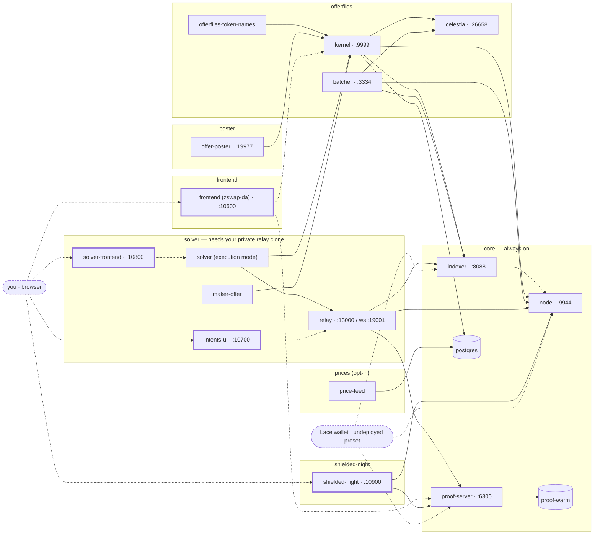

# midnight-1-offers

A one-command **Midnight 1.x** demo stack. `./up.sh` brings up, on your machine, a local
Midnight devnet (node, indexer, proof server), a Celestia DA devnet, the **offer-files
kernel** and its batcher — an on-chain order book of ZSwap offers — the **zswap-da** trading
SPA, the **Shielded NIGHT** dApp (NIGHT ⇄ sNight), and the **Midnight Intents relay + COW
solver** settling real intents against that book. Everything is Docker Compose; every
external artifact is pinned by digest or full commit SHA; every published port is
loopback-bound and parameterizable.

It is the 1.x sibling of [`midnight-2-offers`](https://github.com/acedward/midnight-2-offers)
— same layout, same scripts, same profiles where the two overlap; the differences are
[at the end](#how-this-differs-from-midnight-2-offers).

**Everything here is dev-only.** Every seed in this repo is public and controls value only on
a throwaway local `undeployed` chain. Never reuse any of them anywhere else.

## Quickstart

```sh
cp .env.example .env                       # ports, seeds and pins; defaults are the Midnight-standard ports
./up.sh --with offerfiles --with frontend --with shielded-night --with poster
./verify.sh                                # assert the stack is usable, not merely running
```

That is every profile that builds from public sources. The `solver` profile (the intents
relay, its UI and the COW solver) builds from a **private** clone you provide — set
`RELAY_SOURCE_DIR` first ([how](#the-solver-profile-needs-private-repository-access)),
then `./up.sh --all` is the whole stack. `up.sh` blocks until each service is genuinely
usable, not merely started.

**Options** — each `--with` adds one profile, a profile is one fragment in `compose/`:

```sh
./up.sh                                    # core alone
./up.sh --with offerfiles                  # …and Celestia + kernel + batcher
./up.sh --with offerfiles --with frontend  # …and the SPA
./up.sh --with shielded-night              # the Shielded NIGHT dApp (core is all it needs)
./up.sh --with offerfiles --with shielded-night   # …and sNight is tradable on the offer book
./up.sh --with offerfiles --with prices    # …and live CoinGecko reference prices (needs a key)
./up.sh --all                              # every profile
./verify.sh                                # assert the stack is usable, not merely running
./down.sh -v                               # stop and wipe every volume of this project
```

`--with` is additive: it never stops a profile that is already up. `--converge` is the
opposite and names everything it is about to stop before it does it.

## What to expect

When `up.sh` returns, these are live (default ports; every one is overridable in `.env`):

| Open | With | What you get |
|---|---|---|
| **http://127.0.0.1:10600** | `frontend` | the zswap-da SPA: the offer book, the faucet, post and take offers in whole coins |
| **http://127.0.0.1:10900** | `shielded-night` | wrap NIGHT into sNight and back; with `offerfiles` up, sNight trades on the book |
| **http://127.0.0.1:10700** | `solver` | the Midnight Intents UI: submit an intent, watch the solver settle it |
| **http://127.0.0.1:10800** | `solver` | the solver monitor: is it quoting, and if not, why |
| `http://127.0.0.1:9999/v1/prices` | `offerfiles` | the kernel API — offers, quotes, reference prices |

With `poster` up the book fills itself: one sponsored, takeable offer a minute, so the SPA has
something real to trade against without a second human. `./verify.sh` drives every profile
that is up end to end (wrap → post → take → unwrap, with exact balances) and prints one
section per profile; `./down.sh` stops and keeps the chain, `./down.sh -v` wipes every volume.
Wallets, seeds and how to import them into Lace: [`docs/WALLETS.md`](docs/WALLETS.md).
What each service does in detail: [`docs/COMPONENTS.md`](docs/COMPONENTS.md). Operating it,
upgrading a pin, two stacks at once: [`docs/OPERATIONS.md`](docs/OPERATIONS.md).

## Profiles

A profile **is** a compose fragment in `compose/`, named after the file. There are exactly
eight, and `compose:` `profiles:` keys are never used anywhere in this repository — `up.sh`
never passes `--profile`, so a service carrying one would silently never start.

Every box below is one compose service with its default host port; solid arrows are
`depends_on`, dotted arrows are runtime reads that carry no start-order guarantee. The
rounded boxes are you: a browser on the four web UIs, and a Lace wallet on the
`undeployed` preset, which is why the core ports default to `9944` / `8088` / `6300`.



One row per profile, in the order `--all` starts them. Service names are the compose names
you use with `docker compose … logs <service>`. Ports are the `.env.example` defaults.

| Profile | Services | Default endpoints |
|---|---|---|
| [`core`](compose/core.yml) — always | `node` · `indexer` · `proof-server` · `proof-warm` · `postgres` | node RPC `http://127.0.0.1:9944` · indexer `http://127.0.0.1:8088` · proof `http://127.0.0.1:6300` · postgres internal |
| [`offerfiles`](compose/offerfiles.yml) | `celestia` · `kernel` · `batcher` | kernel API `http://127.0.0.1:9999` · batcher `http://127.0.0.1:3334` · Celestia DA RPC `http://127.0.0.1:26658` |
| [`frontend`](compose/frontend.yml) | `frontend` | zswap-da SPA `http://127.0.0.1:10600` |
| [`shielded-night`](compose/shielded-night.yml) — needs only `core` | `shielded-night-deploy` · `shielded-night` · `shielded-night-token-name` · `shielded-night-verify` | sNight dApp `http://127.0.0.1:10900` |
| [`solver`](compose/solver.yml) — needs `RELAY_SOURCE_DIR` **and `issuer`** | `relay` · `solver-provision` · `solver-inventory` · `maker-provision` · `maker-inventory` · `maker-offer` · `solver` · `solver-frontend` · `intents-ui` | relay `http://127.0.0.1:13000` · relay WS `:19001` · monitor **`http://127.0.0.1:10800`** · intents UI `http://127.0.0.1:10700` · status listener `solver:9100` internal only |
| [`poster`](compose/poster.yml) — needs **`issuer`** | `poster-provision` · `poster-inventory` · `offer-poster` | health `http://127.0.0.1:19977/health` (+ `/metrics`, `/journal`) |
| [`prices`](compose/prices.yml) — opt-in, needs `COINGECKO_API_KEY` | `price-feed` | no port; writes `asset_prices`, read back via kernel `/v1/prices` |
| [`issuer`](compose/issuer.yml) — needs only `core`; **required by `poster` and `solver`** | `issuer-deploy` · `faucet` · `issuer-registrar` · `issuer-fund` · `issuer-registry` · `issuer-tokens-env` | token faucet **`http://127.0.0.1:10500/?network=undeployed`** (the `?network=` is not optional); `docker compose run --rm issuer-fund <TOKEN> <base-units> <recipient-seed> [count]` for the headless lane |

> **`poster` and `solver` REQUIRE `issuer` since 00020 PR C.** Kernel
> [#69](https://github.com/effectstream/zswap-offerfiles-kernel/pull/69) removed the local faucet
> contract, so their swap-token inventory is minted by the issuer. `./up.sh` adds the profile for
> you and says so in one line; a hand-rolled `docker compose -f …` without it refuses to render,
> naming `issuer-deploy`.

What each profile actually does, service by service — the whole-coin line, the sponsorship
gate, the exact-coin guarantee, the price feed's key rules, the sNight round trip — is in
[`docs/COMPONENTS.md`](docs/COMPONENTS.md).


## Everything external is pinned

No tags, no branch names, no "latest". Official images are pinned by **index digest**, source
builds by **full 40-hex commit SHA**, downloaded binaries by **SHA-256**. The single record is
[`config/artifact-decisions.json`](config/artifact-decisions.json), and four offline gates
keep it and the repository in agreement:

| Gate | Asserts |
|---|---|
| `./scripts/render-readme-pins.py --check` | the README's pin table below still says what the compose defaults, the Dockerfile `ARG`s, `.env.example` and the matrix say — and that no source pin has two different defaults in the tree |
| `./scripts/verify-artifact-decisions.sh --self-test` | the matrix is internally consistent, still makes the choices it froze, and its `pinsDigest` still covers every identity field |
| `./scripts/verify-compose-pins.sh --self-test` | the **rendered** compose configuration really asks for those bytes — no tag-only image, no forced `platform:`, no `profiles:` key, no drifted build arg |
| `./scripts/verify-source-pins.sh` | the images that are actually **running** were built from the configured commits (needs a live stack) |

All four are offline: no daemon, no network, no registry, no credential.

### Where every component comes from

The **Pin** column links to the exact commit; the **Pinned in** column is every file that
carries that default, so you know what to edit. **This table is generated** —
`scripts/render-readme-pins.py --write` renders it from the sources above, the prose per row
lives in [`config/readme-components.json`](config/readme-components.json), and `ci-check.sh`
fails when the block is stale.

<!-- render-readme-pins:begin — GENERATED by scripts/render-readme-pins.py --write from compose/, images/, .env.example and config/artifact-decisions.json. Edit config/readme-components.json, not this block. -->
| Component | Source | Pin | Pinned in |
|---|---|---|---|
| Midnight node `1.0.1` | [`midnightntwrk/midnight-node`](https://hub.docker.com/r/midnightntwrk/midnight-node) *(upstream image)*, `CFG_PRESET=dev` | index digest `a340cdea456d…` | `config/artifact-decisions.json` · `.env.example` |
| Indexer `4.3.3` | [`midnightntwrk/indexer-standalone`](https://hub.docker.com/r/midnightntwrk/indexer-standalone) *(upstream image)* | index digest `03afd079b00b…` | `config/artifact-decisions.json` · `.env.example` |
| Proof server `8.1.0` (+ `proof-warm` pre-warm) | [`midnightntwrk/proof-server`](https://hub.docker.com/r/midnightntwrk/proof-server) *(upstream image)* | index digest `801bbc0340e9…` | `config/artifact-decisions.json` · `.env.example` |
| Celestia app `6.4.10` / node `0.28.4` | [`effectstream/binaries@0.3.120`](https://github.com/effectstream/binaries/releases/tag/0.3.120), each archive byte-equal to the official celestiaorg release | SHA-256 per arch | `config/artifact-decisions.json` · `.env.example` · `compose/offerfiles.yml` · `images/celestia/Dockerfile` · `scripts/lib/common.sh` |
| PostgreSQL + `pg_ivm 1.11` | `postgres` *(upstream image)* with `pg_ivm` compiled in | `PG_IVM_VERSION=1.11` | `.env.example` · `compose/core.yml` · `images/postgres/Dockerfile` |
| **Offer-files kernel · batcher · COW solver · maker-offer · offer poster · price feed** (ONE image) | [`effectstream/zswap-offerfiles-kernel`](https://github.com/effectstream/zswap-offerfiles-kernel) `main`, the EXTERNAL-INVENTORY line since kernel [#69](https://github.com/effectstream/zswap-offerfiles-kernel/pull/69): the local faucet contract is deleted, so this image compiles NOTHING (no Compact stage, no `COMPACT_VERSION`) and every token comes from the `issuer` profile below. Per-token decimals, not 6 everywhere. The solver has no second pin and no `.solver-commit`. **BREAKING for an existing `postgres` volume** — `000-init.sql` reseeds `known_tokens` and adds `canonical_token_registry_state`, so `./down.sh -v` is the upgrade path | [`e3b9388d11df`](https://github.com/effectstream/zswap-offerfiles-kernel/commit/e3b9388d11dfe1a6c5554a4c8699250fe595e4ce) | `.env.example` · `compose/offerfiles.yml` · `compose/solver.yml` · `images/offerfiles-kernel/Dockerfile` · `scripts/lib/common.sh` |
| zswap-da SPA | [`effectstream/effectstream` `templates/zswap-da`](https://github.com/effectstream/effectstream/tree/400880ceb6814738d1ae193dae18ad5128922edc/templates/zswap-da), `midnight-1` head — v8-native, no ledger patch. Since effectstream [#922](https://github.com/effectstream/effectstream/pull/922) it COMPILES NOTHING: the template's Compact source, build script and manifest are deleted with the kernel's contract, so this image has no Compact stage and no `COMPACT_VERSION`. [#920](https://github.com/effectstream/effectstream/pull/920) replaced the in-page Faucet tab with a LINK to this stack's own `issuer` faucet site (`VITE_FAUCET_URL`) and made `VITE_MIDNIGHT_NETWORK_ID=undeployed` a required build input | [`400880ceb681`](https://github.com/effectstream/effectstream/commit/400880ceb6814738d1ae193dae18ad5128922edc) | `.env.example` · `compose/frontend.yml` · `images/zswap-da/Dockerfile` · `scripts/lib/common.sh` |
| Shielded NIGHT dApp | [`effectstream/shielded-night`](https://github.com/effectstream/shielded-night) `main` (the 1.x line); the v1 contract is recompiled in-image with compactc 0.31.1 and must be byte-identical to the committed artifacts. Since [#13](https://github.com/effectstream/shielded-night/pull/13) the page is multinetwork and picks its protocol from a `protocolFamily` per network — `undeployed` is `midnight-1.x`, so this stack runs the v1/ledger-v8 adapter out of `frontend/protocols/v1`; the Midnight-2.x lane (`contracts/v2`, compactc 0.34.0) is served but unreachable here. [#14](https://github.com/effectstream/shielded-night/pull/14) moved the served proving assets to `contract/v1/shielded-night`, resolved against the page origin | [`2bb32838a057`](https://github.com/effectstream/shielded-night/commit/2bb32838a0572019a49436c3743bae7d0299817a) | `.env.example` · `compose/shielded-night.yml` · `images/shielded-night/Dockerfile` · `scripts/lib/common.sh` |
| **Token issuer** — `issuer-deploy` · faucet site · `issuer-registrar` · `issuer-fund` (ONE image, two targets) | [`effectstream/mint-test-tokens`](https://github.com/effectstream/mint-test-tokens) `main` (public, already on the 1.x line); the six v1 token contracts are deployed once per devnet on `undeployed`, and all three v1 contracts are recompiled in-image with compactc 0.31.1 and byte-compared against the committed artifacts. This is what replaces the kernel's removed local faucet: `TWBTC` (8 dec) `TWETH` (18) `TWUSDC` (6) `TWUSDM` (6) `UTWUSDC` (6, unshielded) `UTWBTC` (8, unshielded) | [`7ecad008b07a`](https://github.com/effectstream/mint-test-tokens/commit/7ecad008b07acb2a491d8291e05455cbd638910f) | `.env.example` · `compose/issuer.yml` · `images/issuer/Dockerfile` · `scripts/lib/common.sh` |
| Midnight Intents relay + intents UI | `shieldedtech/midnight-intents-swaps` — **PRIVATE**; you supply the clone via `RELAY_SOURCE_DIR`, `up.sh` verifies it sits at the pin with a clean tree before any build. Since 00020 PR F the UI labels each token and scales its amounts from `TOKEN_<NAME>` + `METADATA_TOKEN_<NAME>_LABEL/_DECIMALS` baked at build time, which `scripts/issuer-token-names.sh` fills in from the issuer registry | `b32e0b100a57…` (`RELAY_REF`, verified before build) | `.env.example` · `compose/solver.yml` · `scripts/lib/common.sh` · `images/relay/` · `images/intents-ui/` |
<!-- render-readme-pins:end -->

## Layout

```
compose/     core.yml, offerfiles.yml, frontend.yml, shielded-night.yml, solver.yml,
             poster.yml, prices.yml — one fragment per profile
images/      build contexts for the locally built images — one directory per image
scripts/     verify-*.sh gates, pick-ports.sh, ci-check.sh, lib/ (shared bash + python)
config/      artifact-decisions.json — the frozen pin record; readme-components.json — the
             rows of the README's generated pin table
docs/        COMPONENTS.md, OPERATIONS.md, WALLETS.md, KNOWN-LIMITATIONS.md
wallets/     wallets.json — the dev wallet roster (DEV SEEDS ONLY, no real funds)
local/       gitignored: where you put your own clone of the private relay source
up.sh down.sh verify.sh
.env.example copy to .env; the port block, seeds and pins live here
```

## Running two stacks side by side

Nothing hardcodes a cross-service port. Override the port block and
`COMPOSE_PROJECT_NAME` in a second env file and both stacks coexist:

```sh
./scripts/pick-ports.sh > .env.test     # a random free block above 10100 + a unique project
ENV_FILE=.env.test ./up.sh --all
ENV_FILE=.env.test ./down.sh -v
```

Defaults are the Midnight-standard ports (`9944` / `8088` / `6300`), because Lace's
`undeployed` preset hardcodes them.

## Scope and safety

- `undeployed` devnet only. **No real funds, ever.** Every seed in `wallets/wallets.json` is
  a public dev seed on a throwaway local chain; never reuse one anywhere else.
- The stack uses its own `COMPOSE_PROJECT_NAME` (default `midnight-1-offers`), so it cannot
  collide with a `midnight-2-offers` stack on the same machine.

## The `solver` profile needs private repository access

The Midnight Intents relay and its browser UI come from `shieldedtech/midnight-intents-swaps`,
a **private** repository. Their source is never fetched, vendored or mirrored here: you clone
it yourself and point `RELAY_SOURCE_DIR` at the workspace directory inside that clone.

```sh
git clone git@github.com:shieldedtech/midnight-intents-swaps.git ./local/intents-swaps
git -C ./local/intents-swaps checkout b32e0b100a5715d1fbf89c155afe6c2236d3b013
echo 'RELAY_SOURCE_DIR=./local/intents-swaps/phase1-native-swaps' >> .env
```

`up.sh` checks that clone is at the pinned commit with a clean tree before any build starts,
and the images built from it are never pushed to any registry. Without access you still get
every other profile. How this repository keeps that source out of a public tree, and the gate
that proves it: [`docs/OPERATIONS.md`](docs/OPERATIONS.md#the-solver-profiles-private-source).

## How this differs from midnight-2-offers

Beyond the version line (Midnight 1.x here, 2.x there):

- **dropped**: the AA profile (aa-contracts, AA console, experimental proof server) and the
  EVM profile — neither exists here.
- **added**: the real Midnight Intents relay and its browser UI, with the COW solver in
  **execution mode** settling relay intents against the kernel book. `midnight-2-offers`
  deliberately stopped at an observation-only sink; this repository runs the whole lane.
- **added**: the `poster` profile — the kernel's own **offer poster**, a funded, dedicated
  wallet that mints one faucet coin a minute and posts one sponsored, individually takeable
  ZSwap offer spending exactly that coin. The book supplies itself, so the SPA has something
  real to trade against without a human.
- **added**: the `prices` profile — the kernel's own **price feed**, one CoinGecko
  `simple/price` call a day into `asset_prices`, so the USD reference behind `GET /v1/prices`,
  `GET /v1/quote` and the sponsorship gate is live rather than the schema's 2026-09-02 seeds.
  It needs a free CoinGecko demo key in `.env` — the only secret in this stack — and without
  one it comes up and idles, because the seeded prices already quote real ratios.
- **added**: the `shielded-night` profile — [`effectstream/shielded-night`](https://github.com/effectstream/shielded-night),
  a Compact contract plus a page that wraps native unshielded NIGHT into a shielded token
  (**sNight**) 1:1 and back. It depends only on `core`, deploys its contract once per stack,
  and is verified by upstream's own integration round trips run against this stack. Bring it up
  **with `offerfiles`** and native NIGHT becomes tradable on the offer-files book: `./verify.sh`
  wraps it, posts a real MIP-0005 offer file carrying sNight, has a second wallet settle that
  offer, and has that wallet unwrap what it bought — with exact balances at every step.

The stack tracks the offer-files kernel's own `main` — the **whole-coin line**: every token is
6 decimals and one faucet press mints 1 000 whole coins (1 000 000 000 base units), with the
`zswap-da` SPA on its matching `midnight-1` head. The exact pins are in the
[generated table above](#where-every-component-comes-from). **Re-pinning an EXISTING stack
across a kernel schema change is BREAKING for its `postgres` volume — `./down.sh -v` first;
[`docs/OPERATIONS.md`](docs/OPERATIONS.md) says which steps are and are not.**

## Licence

There is no `LICENSE` file, matching `midnight-2-offers`. This repository is published for
demonstration and review; no licence is granted by its being public. That is a deliberate,
recorded stance, not an oversight — if the sibling repository gains a licence, this one
follows it.
